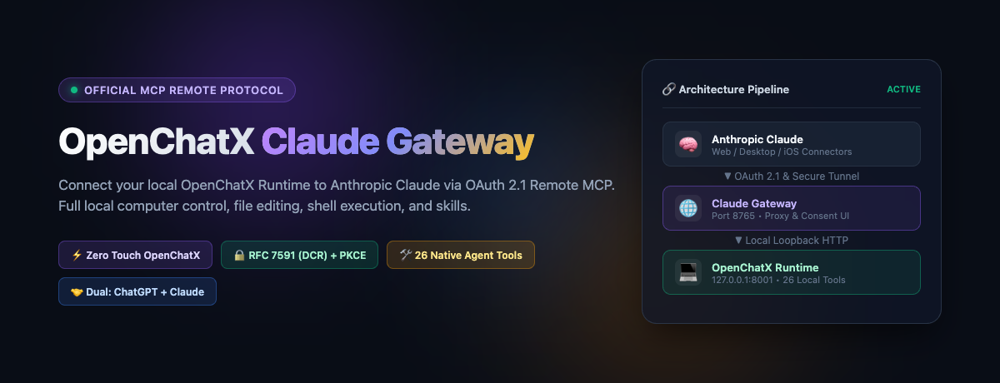
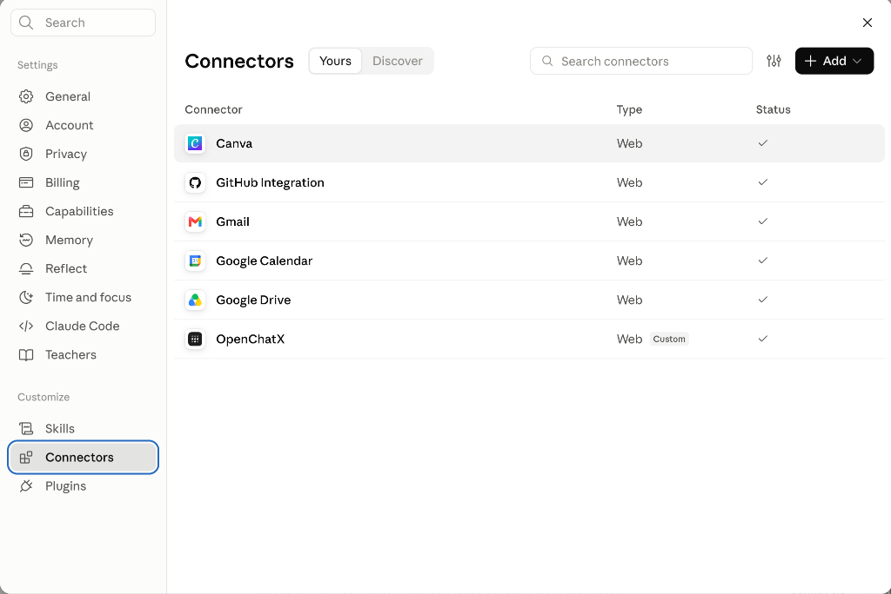

# 🌐 OpenChatX Claude Gateway

<p align="center">
  <a href="README.md">繁體中文</a> | <b>English</b> | <a href="https://iancheng64-cmd.github.io/openchatx-claude-gateway/">🌐 Live Showcase (GitHub Pages)</a>
</p>

<p align="center">
  
</p>

<p align="center">
  <b>Connect your local OpenChatX Agent Runtime to Anthropic Claude (Web & Mobile) via spec-compliant OAuth 2.1 Remote MCP.</b>
  <br>
  <i>Empower Claude Free, Pro, and Team accounts with full local machine autonomy — File I/O, Terminal Shell, Skills, and Computer Control.</i>
</p>

<p align="center">
  
  
  
  
  
</p>

---

## 💡 Introduction

**OpenChatX** is a powerful open-source desktop AI Agent application (created by XiaoPuOuO), natively designed to pair with ChatGPT (via OpenAI's Secure MCP Tunnel) for operating local macOS/Windows environments.

However, many developers and power users want to turn **Anthropic Claude (Web, Desktop, or iOS/iPad App)** into a true local agent as well. Anthropic Claude's Custom Connectors require:
1. **A public HTTPS endpoint** (Anthropic servers cannot directly reach your loopback `127.0.0.1`).
2. **Strict RFC-compliant OAuth 2.1 authorization** (Dynamic Client Registration [DCR] or CIMD, PKCE S256, Protected Resource Metadata, and an interactive browser consent approval flow).

**OpenChatX Claude Gateway** was created to bridge this exact gap with zero modifications to the core application.

> ⚠️ **Important Guarantee: Vanilla OpenChatX remains 100% untouched!**  
> You do **NOT** need to recompile, modify source code, or rebuild any `.dmg` installers. Simply run the official, unmodified OpenChatX App alongside this lightweight gateway and tunnel. Both Claude and ChatGPT can simultaneously share the exact same local OpenChatX Core Runtime!

---

## 🏗️ Architecture

```mermaid
flowchart TD
    subgraph Cloud [Cloud Providers]
        ChatGPT[ChatGPT Web / App]
        Claude[Claude Web / Mobile App]
    end

    subgraph Tunnel [Secure Public Ingress]
        OpenAITunnel[OpenAI Secure MCP Tunnel]
        PublicIngress[Tailscale Funnel / Cloudflare Tunnel<br/>https://your-domain.ts.net]
    end

    subgraph LocalMac [Your Local Machine (macOS)]
        subgraph Gateway [OpenChatX Claude Gateway (Port 8765)]
            OAuthServer[OAuth 2.1 Server<br/>DCR / PKCE / Consent UI]
            ReverseProxy[Streamable HTTP<br/>Reverse Proxy]
            Database[(gateway.db<br/>Encrypted Clients & Tokens)]
        end

        subgraph OpenChatXApp [Vanilla OpenChatX.app (Port 8001)]
            CoreRuntime[OpenChatX Core Runtime<br/>127.0.0.1:8001/mcp]
            Tools[26 Local Agent Tools<br/>Files / Shell / Terminal / Skills / Subagents]
        end
    end

    ChatGPT -->|Direct Tunnel| OpenAITunnel --> CoreRuntime
    Claude -->|Remote MCP & OAuth| PublicIngress --> ReverseProxy
    PublicIngress <-->|OAuth Handshake| OAuthServer
    OAuthServer <--> Database
    ReverseProxy -->|Loopback HTTP| CoreRuntime
    CoreRuntime --> Tools
```

---

## ✨ Key Features

* **Zero-Touch Integration**: No patching or tampering with the official OpenChatX binary. Clean and secure.
* **Dual-Provider Coexistence**: ChatGPT and Claude can connect to the same local OpenChatX runtime simultaneously without conflict.
* **Supports Claude Free, Pro & Team**: Works directly in desktop browsers (Chrome, Safari, Edge, etc.) as well as mobile apps.
* **RFC-Compliant OAuth 2.1 Engine**: Complete implementation of RFC 7591 (Dynamic Client Registration - DCR), RFC 7636 (PKCE S256), RFC 8707 (Resource Indicators), and encrypted credential storage.
* **Automated Background Daemon**: Includes a macOS LaunchAgent template to start automatically on login without occupying an active terminal window.
* **Unlocks All 26 Local Agent Tools**: Complete file I/O, regex search, terminal command execution, project management, subagent orchestration, and cross-session memory transfer.

---

## 🚀 Quick Start (3 Minutes)

### Step 1: Ensure OpenChatX App is Running
Ensure that the official **OpenChatX.app** is installed and running on your Mac (by default, it provides the MCP service on `127.0.0.1:8001`).

### Step 2: Clone & Run the Setup Wizard
Open your terminal and run:

```bash
# 1. Clone the repository
git clone https://github.com/iancheng64-cmd/openchatx-claude-gateway.git
cd openchatx-claude-gateway

# 2. Run the interactive setup wizard
bash scripts/setup.sh
```

The `setup.sh` script will automatically:
* Create a Python virtual environment and install dependencies.
* Generate a unique Fernet encryption key for token and client security.
* Generate a cryptographically valid bcrypt password hash (default credentials: `openchatx` / `openchatx`).
* Auto-detect and configure your public tunnel domain (Tailscale Funnel or Cloudflare Tunnel).
* Generate `config.yaml` and optionally register a macOS background daemon (`launchd`).

---

### Step 3: Configure Public Ingress

Claude's servers require an HTTPS connection to reach your gateway. Choose either of the two **100% free** options below:

#### Option A (Recommended): Tailscale Funnel
If you use Tailscale, this provides a persistent, dedicated domain with zero maintenance:
```bash
bash scripts/tunnel-tailscale.sh
```
This produces a persistent URL such as `https://your-macbook.sawfish-mirach.ts.net`. Set this value in `config.yaml` under `server.public_url`.

#### Option B: Cloudflare Quick Tunnel
If you do not use Tailscale, launch a free instant tunnel via Cloudflare:
```bash
bash scripts/tunnel-cloudflare.sh
```
The terminal will display an ephemeral URL like `https://*.trycloudflare.com`.

---

### Step 4: Add the OpenChatX Connector in Claude

1. Open your browser (Chrome, Safari, etc.) and sign in to [claude.ai](https://claude.ai).
2. Click your profile avatar in the bottom-left corner ➔ **Settings** ➔ navigate to **Connectors** in the sidebar ➔ click the **Yours** tab.
3. Click the **Add** button in the upper-right corner ➔ select **Add custom connector**.
4. **Step 1 of 2**:
   * **Name**: `OpenChatX`
   * **MCP server URL**: Enter your public URL appended with `/mcp` (e.g., `https://your-machine.ts.net/mcp`).
   * Click **Continue**.
5. **Step 2 of 2**:
   * **Authentication**: Select `Sign in now` (detected automatically).
   * **OAuth client**: Select **`Register automatically (DCR)`** (Important: choose automatic registration).
   * Click **Add** (scroll down if the button is partially out of view).
6. **OAuth Consent Window**:
   * A consent popup will open. Enter your gateway credentials (default: `openchatx` / `openchatx`).
   * Click **Approve**.
7. **Done!** Return to the Connectors list. You should now see **OpenChatX** with a green **Connected** badge (as shown in the verified screenshot below)!

<p align="center">
  
</p>

---

## 💬 How to Use in Claude Conversations

1. In any Claude chat box, click the **`+` (Add files, connectors, and more)** button.
2. Select **Connectors** ➔ check **OpenChatX**.
3. Prompt Claude in natural language, for example:
   * *"Use OpenChatX to list the 5 most recently downloaded files in my ~/Downloads directory."*
   * *"Open my project directory, search for all files containing `fetchUserData`, and run the test suite."*
   * *"Create a new Python script in my workspace to benchmark API endpoints, and execute it to verify the results."*

---

## 🛠️ Complete List of 26 Supported Agent Tools

| Category | Tool ID | Description |
| :--- | :--- | :--- |
| **File Operations** | `openchatx_file_read` | Read contents from a specified file path |
| | `openchatx_file_write` | Create a new file or overwrite file contents |
| | `openchatx_file_edit` | Surgical, precise modifications to code or text |
| | `openchatx_apply_patch` | Apply unified diff/patch across multiple files |
| **File Search** | `openchatx_glob` | Search filenames and directory structures by pattern |
| | `openchatx_grep` | Full-text regular expression search within files |
| | `openchatx_image_view` | Inspect local images or screenshot assets |
| **System Execution** | `openchatx_bash` | Execute shell commands in the local environment |
| | `openchatx_bash_process` | Monitor and manage long-running background processes |
| | `openchatx_terminal` | Interactive pseudo-terminal and REPL connection |
| **Skills & Extensibility**| `openchatx_skill_search` | Search OpenChatX built-in and custom skills |
| | `openchatx_skill_manage` | Add, update, or maintain skill workflows |
| | `openchatx_capability_list` | List active agent capabilities and extensions |
| **Workspace Management** | `openchatx_project_manage` | Configure or switch the active project directory |
| | `openchatx_goal_list` | Inspect pending goals and objectives in the workspace |
| | `openchatx_goal_manage` | Create, update, or resolve task goals |
| | `openchatx_rule_resolve` | Resolve and load behavioral rules for the current task |
| | `openchatx_rule_manage` | Manage custom workspace constraint rules |
| **Advanced Orchestration** | `openchatx_subagent_list` | List available subagent profiles |
| | `openchatx_subagent_run` | Spawn an isolated subagent for delegated tasks |
| | `openchatx_summarize` | Extract conversation context for cross-session handoff |
| | `openchatx_tool_search` | Dynamically retrieve and lazy-load extension tools |
| | `openchatx_tool_call` | Invoke dynamically registered internal tools |
| | `openchatx_fetch_url` | Fetch remote web content and convert to clean Markdown |
| | `openchatx_start_here` | Initialize and align environmental context at chat start |
| | `gateway_status` | Query gateway runtime status and health metrics |

---

## 🔍 Troubleshooting & FAQs

<details>
<summary><b>1. Why does clicking the "Add" button in Claude have no effect?</b></summary>

On certain MacBook screen resolutions, the custom connector modal may be taller than the browser viewport, placing the `Add` button slightly below the visible edge. Use your trackpad or scroll wheel to scroll the modal content down until the `Back` and `Add` buttons are fully in view before clicking.
</details>

<details>
<summary><b>2. Gateway login fails with "Invalid username or password"?</b></summary>

Do not manually type arbitrary strings into `config.yaml` as bcrypt hashes (an invalid format causes Python's bcrypt library to throw `ValueError: Invalid salt` and unconditionally reject authentication). Use the provided hashing script instead:
```bash
python3 scripts/hash_password.py your_new_password
```
Copy the resulting output string into `config.yaml` under `auth.password_hash`.
</details>

<details>
<summary><b>3. Claude reports "Client ID not found (400 Bad Request)"?</b></summary>

This occurs when Claude attempts to authenticate using a Client ID registered via DCR in an older database, while the gateway is currently connected to a newly initialized, empty database. Ensure that `config.yaml`'s `storage.path` continuously points to the same persistent SQLite database file (e.g., `./gateway.db`).
</details>

<details>
<summary><b>4. How can I verify that all services are running properly?</b></summary>

Run the included health check diagnostic script anytime from the project root:
```bash
bash scripts/status.sh
```
This script checks:
1. OpenChatX local runtime connectivity (`127.0.0.1:8001`)
2. Claude Gateway local endpoint (`127.0.0.1:8765`)
3. Public HTTPS ingress tunnel reachability
4. macOS LaunchAgent background service status
</details>

---

## 🔒 Security Model

* **Loopback Isolation**: The local OpenChatX Runtime (`127.0.0.1:8001`) listens strictly on the loopback interface and is never directly exposed to the public internet.
* **At-Rest Encryption**: All dynamically registered OAuth clients, access tokens, and refresh tokens are encrypted using AES-256 (Fernet) inside the local SQLite database.
* **OAuth 2.1 Hardening**: Employs PKCE (Proof Key for Code Exchange) S256 and cryptographic state validation to prevent authorization code interception and CSRF attacks.

---

## 📄 License

This project is licensed under the [MIT License](LICENSE).  
The original OpenChatX application copyright belongs to its respective author.
